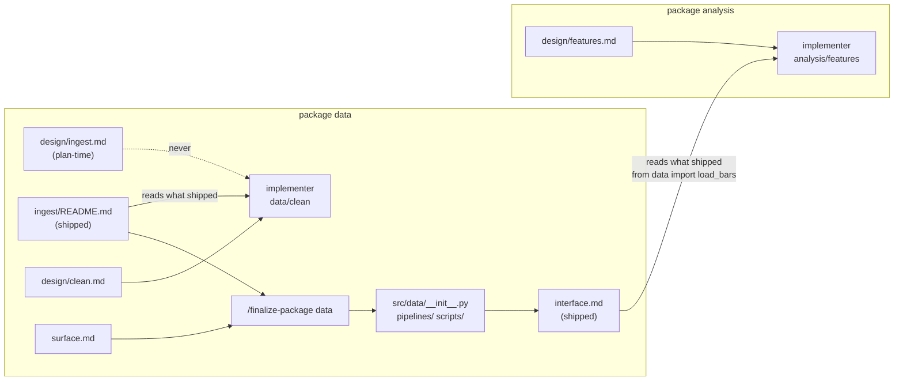
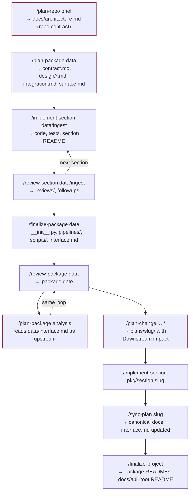
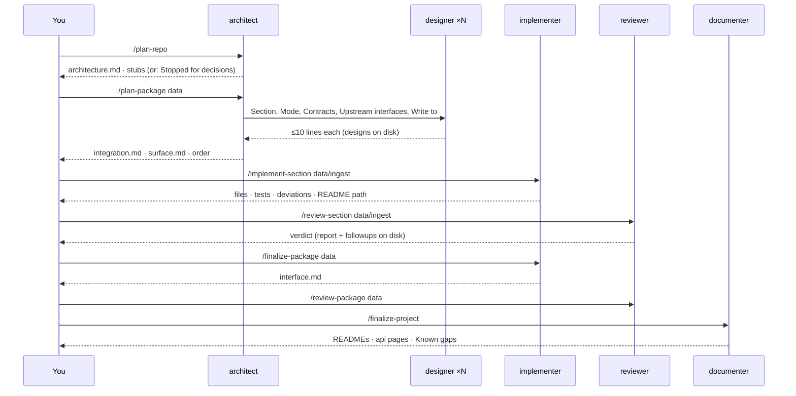

# The flow

The interactive version of this page (click a skill, see what it reads and writes) is the
**project_workers v4 Flow** artifact in your Claude gallery. This page is the same content as
static diagrams so it lives with the bundle.

## Where truth comes from

An implementer builds from its own design but consumes other work from what actually shipped.
Inside a package a dependency is a section, so it reads that section's README. Across packages
a dependency is a package, so it reads that package's `interface.md` and imports only from the
package's top level. Plan-time documents about a provider lose to the shipped document every
time.

## The week-by-week loop

Nodes with the dark-red border can **stop** with questions in `docs/decisions.md`; re-running
the same command continues.

## Hand-offs

## Order of authority

**For what a section builds** (tie-break, highest first): `decisions.md` (decided, in scope) →
the integration doc for this run → `contract-delta.md` (change work) → the package contract →
the repo contract → the section's design.

**For what a section consumes**: the provider's shipped document — a sibling's README, an
upstream package's `interface.md` — wins over every plan-time document about that provider.

## The `docs/` map

| Path | Kind | Written by | Read by |
|---|---|---|---|
| `docs/brief.md` | canonical | plan-repo | plan-repo, map-project |
| `docs/architecture.md` | **repo contract** | plan-repo; map-project, sync-plan | everyone |
| `docs/decisions.md` | ledger | architect stubs · you · implementer `Applied:` | every agent |
| `docs/followups.md` | queue | implementer, reviewer, sync-plan | implementer, documenter |
| `docs/assessment.md` | survey | map-project, plan-repo (extend) | re-runs |
| `docs/api/<pkg>.md` | site | finalize-project | mkdocs |
| `docs/packages/<pkg>/brief.md` | canonical | plan-package | plan-package |
| `docs/packages/<pkg>/assessment.md` | survey | plan-package, map-project | designers |
| `docs/packages/<pkg>/contract.md` | **package contract** | plan-package; sync-plan | designers, implementer, reviewer, plan-change (Consumes) |
| `docs/packages/<pkg>/design/<section>.md` | plan-time | designer; sync-plan | implementer, reviewer |
| `docs/packages/<pkg>/integration.md` | plan-time | architect; sync-plan | implementer, reviewer, finalize-package |
| `docs/packages/<pkg>/surface.md` | plan-time | architect at unify; sync-plan | finalize-package, review-package, implementer |
| `docs/packages/<pkg>/interface.md` | **shipped** | finalize-package; sync-plan | plan-package and every consumer |
| `packages/<pkg>/src/<pkg>/<section>/README.md` | **shipped** | implementer | dependents, finalize-package, reviewer, documenter |
| `docs/reviews/<date>-<pkg>-<section>.md` | report | reviewer | implementer |
| `docs/plans/<slug>/…` | proposal | plan-change, designers | implementer, sync-plan |
| `docs/plans/synced.md` | ledger | sync-plan | sync-plan, finalize-project |
